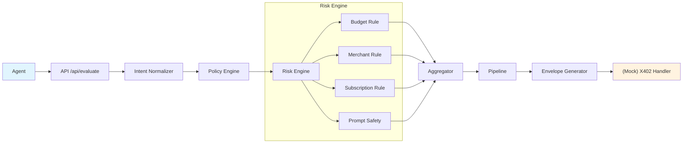

# ZPrivacy402 Backend 

backend for privacy-preserving payment intent evaluation. This project provides a realistic developer-facing skeleton that demonstrates the ZPrivacy402 risk evaluation flow.

## Features

- **Intent Normalization**: Clean and standardize incoming payment intents
- **Policy Engine**: Load and apply agent-specific spending policies
- **Risk Evaluation**: Multi-rule risk assessment including:
  - Budget limit checking
  - Merchant whitelist verification
  - Subscription pattern detection
  - Prompt safety analysis
- **Encrypted Envelope Generation**: Mock payload encryption (placeholder for real crypto)
- **REST API**: Express-based API for intent evaluation
- **CLI Tool**: Command-line evaluation for local testing

## Architecture



## Quick Start

### Installation

```bash
# Clone the repository
git clone https://github.com/yourusername/zprivacy402-backend-mock.git
cd zprivacy402-backend-mock

# Install dependencies
npm install

# Copy environment file
cp .env.example .env
```

### Running the Server

```bash
# Development mode (with hot reload)
npm run dev

# Production mode
npm start
```

Server will start on `http://localhost:3000`

### Running the CLI

```bash
# Generate mock data first
npm run seed

# Run evaluation with mock intent
npm run cli

# Or specify a custom file
node src/cli/run-eval.js mock/intentA.json
```

### Running Tests

```bash
npm test
```

## API Reference

### Health Check

```
GET /health
```

Response:
```json
{
  "status": "ok",
  "timestamp": "2024-01-15T12:00:00.000Z"
}
```

### Evaluate Intent

```
POST /api/evaluate
```

Request:
```json
{
  "agentId": "agent_demo_001",
  "intent": {
    "action": "payment",
    "amount": 25.00,
    "currency": "USD",
    "merchant": "coffee_shop_42",
    "description": "Morning coffee purchase"
  }
}
```

Response:
```json
{
  "status": "success",
  "data": {
    "riskScore": 0.15,
    "riskLevel": "LOW",
    "checks": {
      "budget": { "ok": true, "reason": "Amount within limit", "meta": {} },
      "merchant": { "ok": true, "reason": "Merchant trusted", "meta": {} },
      "subscription": { "ok": true, "reason": "No recurring patterns", "meta": {} },
      "promptSafety": { "ok": true, "reason": "No suspicious tokens", "meta": {} }
    },
    "commitmentHash": "a3f2e8c91b4d6f0e7a8b9c0d1e2f3a4b...",
    "payloadSize": 1248,
    "envelope": "eyJhbGciOiJub25lIiwidHlwIjoiSldUIn0..."
  }
}
```

## Project Structure

```
zprivacy402-backend-mock/
├── src/
│   ├── server.js              # Express server entry point
│   ├── index.js               # Module exports aggregator
│   ├── core/
│   │   ├── intent/
│   │   │   └── intent-normalizer.js   # Intent cleanup & normalization
│   │   ├── policy/
│   │   │   └── policy-engine.js       # Policy loading & management
│   │   ├── envelope/
│   │   │   └── envelope.js            # Mock envelope generation
│   │   └── evaluator.js               # Main evaluation orchestrator
│   ├── risk-engine/
│   │   ├── rules/
│   │   │   ├── budget.js              # Budget limit checking
│   │   │   ├── merchant.js            # Merchant whitelist verification
│   │   │   ├── subscription.js        # Subscription pattern detection
│   │   │   └── promptSafety.js        # Prompt safety analysis
│   │   └── analyzers/
│   │       └── aggregator.js          # Risk score aggregation
│   ├── api/
│   │   ├── index.js                   # API router
│   │   ├── routes/
│   │   │   └── evaluate.js            # Evaluation route
│   │   └── controllers/
│   │       └── evaluateController.js  # Evaluation controller
│   ├── services/
│   │   ├── pipeline/
│   │   │   └── pipeline.js            # Payload building
│   │   └── merchant/
│   │       └── merchantOracle.js      # Mock merchant scoring
│   ├── cli/
│   │   └── run-eval.js                # CLI evaluation tool
│   └── utils/
│       ├── hash.js                    # SHA256 hashing utilities
│       └── logger.js                  # Logging utilities
├── test/
│   └── test_evaluator.js              # Basic test suite
├── scripts/
│   └── seed_mock_data.js              # Mock data generator
├── mock/                              # Generated mock data
├── .env.example
├── .gitignore
├── package.json
├── LICENSE
└── README.md
```

## Configuration

Environment variables (see `.env.example`):

| Variable | Description | Default |
|----------|-------------|---------|
| `PORT` | Server port | 3000 |
| `NODE_ENV` | Environment mode | development |
| `MOCK_MERCHANT_ROOT` | Mock merchant oracle root | mock_root_value |

## Security Notes

### Safe to Publish
- All source code in `src/`
- Test files in `test/`
- Mock data in `mock/`
- Configuration examples (`.env.example`)

### Sensitive (DO NOT COMMIT)
- `.env` file with real credentials
- Any real API keys or secrets
- Production wallet files
- Real cryptographic keys

## Roadmap / Next Steps

1. **Real Cryptography**: Replace mock envelope with actual encryption (libsodium sealed boxes)
2. **Merkle Proofs**: Implement real Merkle tree construction for intent verification
3. **STARK Proofs**: Add zero-knowledge proof generation for privacy
4. **Persistent Storage**: Add PostgreSQL for intent history and audit logs
5. **Real Merchant API**: Integrate with live merchant reputation services
6. **Rate Limiting**: Add request rate limiting for production
7. **Authentication**: Implement JWT-based API authentication
8. **WebSocket Support**: Real-time evaluation status updates

## Contributing

1. Fork the repository
2. Create your feature branch (`git checkout -b feature/amazing-feature`)
3. Commit your changes (`git commit -m 'Add amazing feature'`)
4. Push to the branch (`git push origin feature/amazing-feature`)
5. Open a Pull Request

## License

MIT License - see [LICENSE](LICENSE) file for details.

---

**Remember**: This is a mock implementation for development and demonstration purposes. Production deployments require proper security measures, real cryptographic implementations, and thorough security audits.
